# Wonders Of The World

Wonders Of The World is an online travel company that tailors travel to peoples specific needs. It allows the traveller the ease of planning a bespoke trip to a destination in the world at an affordable price.

The purpose of the website is to allow the customer to choose any destination in the world they would like to travel to, allowing them the ease of tailoring their trip to their specific needs. Once they have chosen there is a way to contact the business so they can discuss and book their trip.

The website targets 1st time and seasoned travellers of all ages who want the ease of booking a holiday tailored to their specific needs all through one company at an affordable all inclusive price. For example a lone female traveller want's safe place's to stay while she back pack's across India using the train service. The traveller can book all of this and then discuss there specific needs with one company.

## Table of contents

1. [User Experience (UX)](#user-experience-ux)
    1. [Project Goals](#project-goals)
    2. [User Stories](#user-stories)
    3. [Color Scheme](#color-scheme)
    4. [Typography](#typography)
    5. [Wireframes](#wireframes)
2. [Features](#features)
    1. [General](#general)
    2. [Landing Page](#landing-page)
    3. [Treatments Page](#gallery-page)
 3. [Technologies Used](#technologies-used)
    1. [Languages Used](#languages-used)
    2. [Frameworks, Libraries and Programs Used](#frameworks-libraries-and-programs-used)
4. [Testing](#testing)
    1. [Testing User Stories](#testing-user-stories)
    2. [Code Validation](#code-validation)
    3. [Accessibility](#accessibility)
    4. [Tools Testing](#tools-testing)
    5. [Manual Testing](#manual-testing)
5. [Finished Product](#finished-product)
6. [Deployment](#deployment)
    1. [GitHub Pages](#github-pages)
7. [Credits](#credits)
    1. [Content](#content)
    2. [Media](#media)
    3. [Code](#code)
8. [Acknowledgements](#acknowledgements)
***

## User Experience (UX)

### Project Goals

* The website should be eye catching and vibrant.

* The website should have be vibrant with colors that mesh well together so that it looks visually appealing to customers.

* The website should make it easy for customers to choose how many people are going on the trip, along with where they want to go and what they want to do.

* The website should provide customers with a way to contact the company to discuss and book their package through the company's booking form.

* The website should entice the customer to choose any style of holiday to any country the website offers with ease. It should be so enticing the customer should want to come back and let their friends and family know about it.

### User Stories

* As a customer I want to choose my travel dates.

* As a customer I want to be able to choose how many people the trip is for.

* As a customer I want to choose where I want to travel too.

* As a customer I want to choose where I want to stay and the type of accommodation I want to stay in.

* As a customer I want to be able to choose excursions and include them in my trip.

* As a customer I want to navigate the website with ease.

* As a customer I want to be able to locate any social media links easily.

* As a customer I want to be able to contact the company with ease.

### Color Scheme

The colors used on the website are #FF6347 used for the text to help the text stand out. I pulled #49492B from the background image which 
is used for the nav bar and footer. For the hover features I used #49492B #ddd to keep with the aesthetics of the background picture.

### Typography
The main fonts used in the website are Pacifico with a fall back of Cursive in case Pacifico isn't being imported correctly. This is used for 
the Business logo, sub headings and buttons. Epunda-Slab with a fall back of sans-serif is used for all the other text on the website for 
better readability for a better user experience.

### Wireframes

[Balsamiq](https://balsamiq.com/) has been used to showcase a basic mock up of the site and display the placement of different elements on the pages.

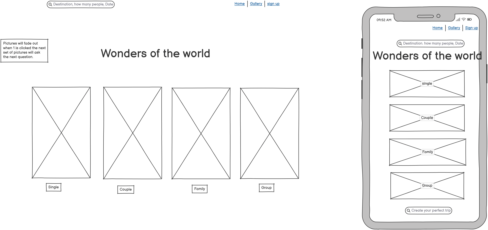

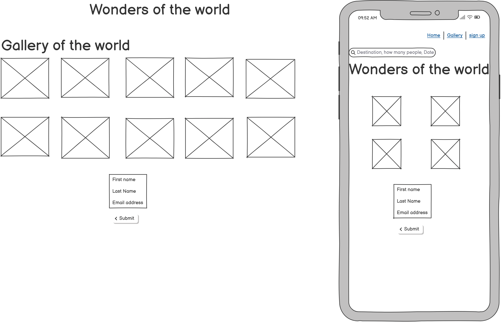

[Back to top ⇧](#wonders-of-the-world)

## Features

The Hover feature has been used on the navigation links, along with the breakdown list of the users choices and all buttons on the website.
There is a modal used on the gallery page along with the hover feature as well.

* Responsive design across all device sizes.

* Similar colour scheme throughout to make it easy for the user to navigate.

* Written explanations to help the user understand the flow of the website for a better UX.

### General

* **Header**

    - The Navigation bar sits across the top of the page with the business logo on the left and the navigation links on the right.

    - The navigation links use the hover effect that change color to provide the user with feed back for a better UX.

    - The links on the navigation bar are fully responsive to assist with navigation across the website. Clicking the home navigation link allows 
    the user to reload the site from the introduction page. 
    
    - The header has the business name right beneath the navigation bar on all 3 pages to help keep the aesthetic the same across the website.

* **Footer**

    - The footer has links to the business' social media channels and it has the business name in it as well.

    - The social media links use the hover feature and change color to white when hovered over to draw attention to the social media links and give a better UX.

    * **Background Image**
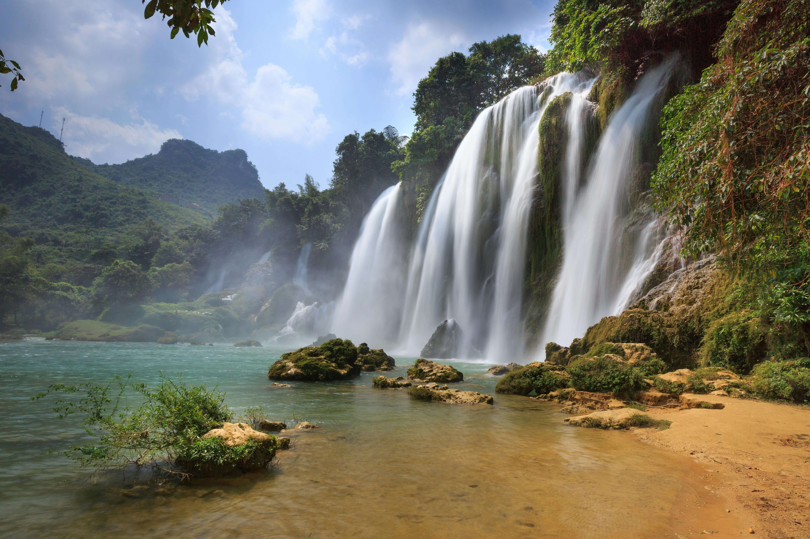

    - The background image is used arcoss the site on all pages. It is used to convay a sense of tranquility which is something people associate with vactions.

### Landing Page

* **Introduction Screen**

    - On the first page the user comes to when they enter the website is the introduction section. This displays a message for 5 seconds to aid the user in understanding what the website is about.

    - There is a skip button right below the wording so the user can skip right to the date picker if they have used the website before and already know what to do.
    This was added for a better UX.

    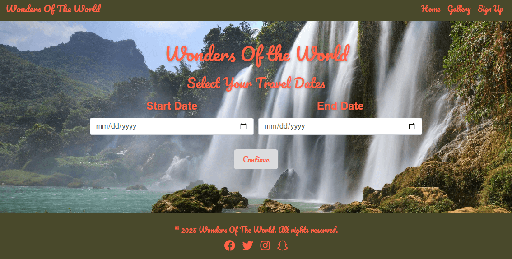

    - Below the introduction is a date picker which lets the user choose what dates they wish to leave and return. The date picker is displayed underneath the introduction section for 5 seconds once the introduction fades or if the user clicks the skip button the date picker is the next sction the user will come to. 
    
    - The user will need to pick a date they wish to leave and return, to advance to the next screen the user will need to click the continue button which uses the hover feature.

* **Image questions**

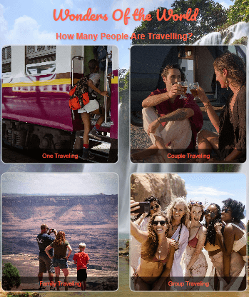

    - The user will come to a set of 4 images with a question above. Each image represents the number of people they might be travelling with. 
    The images use the hover feature once the user click on an image the 4 images will fade out and the next set of 4 images will fade in.

    - The user will come to another set of images with a question above. Each image represents a different type of hoilday experiance the user may want.
    - The images use the hover feature once the user click on an image the 4 images will fade out and the next set of 4 images will fade in.

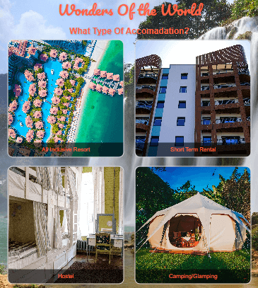

    - The user will come to another set of images with a question above. Each image represents a different type of accomadation the user may want to stay in.
    - The images use the hover feature once the user click on an image the 4 images will fade out and the next set of 4 images will fade in.

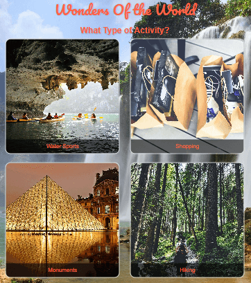

    - The user will come to another set of images with a question above. Each image represents a different type of activity the user may want to do.
    - The images use the hover feature once the user click on an image the 4 images will fade out and the next set of 4 images will fade in.

    - The user will come to another set of images with a question above. Each image represents a different type of Country that the user may want to travel to.
    - The images use the hover feature once the user click on an image the 4 images will fade out and the next set of 4 images will fade in.

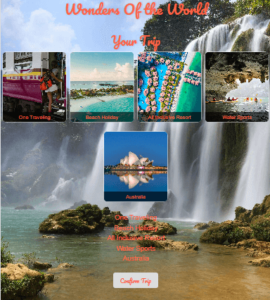

    - This displays all the users image choices along with a break down list of those choices. The breakdown list uses the hover feature which turns each list choice to white for better visablity for a better UK.
    - Below this is a button which states "Confirm Trip". The user will need to click this button to advance to the next screen.

### Sign Up Page

* **Chosen Trip**

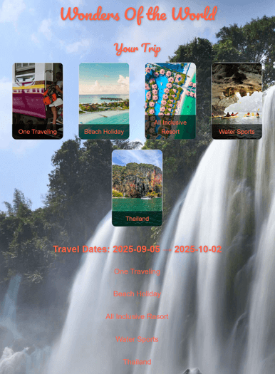

    - Once the user has clicked the "Confirm Trip" button on the final set of image questions, the images will fade out and the the user will be taken to the final page of the website.
    - The images that fade in will be all of the users choices, along with a breakdown list which includes there chosen travel dates.

    - Below the users final chosen images and the breakdown list os a booking form. The user can use this form to contact the business to get further information to make there trip bespoke and book.

### Gallery Page

* **Image Gallery**

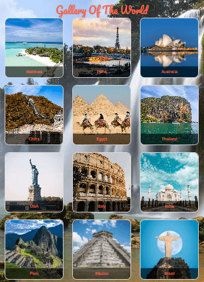

    - This is the 2nd page of the website which has images of different countrys in the world. The images use the hover feature.

    - When the user clicks on any image a modal will pop up with a breif wikipedia description about that county and a link to wikipedia which will give them more information.

### Sign up Page

* **Sign Up Page**

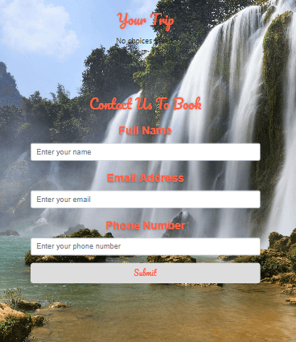

    - This is the last page of the website. The user can decide to use this page without making any choices. They can use the booking form to contact the business to 
    make a bespoke trip over the phone.

[Back to top ⇧](#wonders-of-the-world)

## Technologies Used

* [HTML5](https://en.wikipedia.org/wiki/HTML5)
* [CSS3](https://en.wikipedia.org/wiki/CSS)
* [JavaScript](https://en.wikipedia.org/wiki/JavaScript)

### Languages Used

* [Google Fonts](https://fonts.google.com/)
    - Google fonts was used to import the fonts into the style.css files. The Pacifico font with a back up of Cursive was used for 
    the business name, nav bar, subheadings and buttons on the website. Epunda-Slab with a fall back of sans-serif was used for all the 
    other text on the website for better readability for better a user experience.

* [Font Awesome](https://fontawesome.com/)
    - To create a better visual user experience Font Awesome was used for the social media links throughout the website.

### Frameworks, Libraries and Programs Used

* [Balsamiq](https://balsamiq.com/)
    - Balsamiq was used in the design phase of this project to create the wireframes.

* [Visual Studio Code](https://code.visualstudio.com/)
    - Visual studio code was used to write, commit and push the code to GitHub for this website.

* [GitHub](https://github.com/)
    - GitHub is where the code for this project is stored.

* [Bootstrap](https://getbootstrap.com/)
    - Bootstraps framework was used as I designed this website with mobile devices in mind 1st, using bbotstrap allows for a direct reponsive design.

* [jQuery](https://jquery.com/)
    - jQuery was used on this website. It is a JavaScript library that simplifies the interation between HTML/CSS document traversing and manipulation,
     browser event handling, DOM animations, Ajax interactions, and cross-browser JavaScript development.

* [TinyPNG](https://tinypng.com/)
    - TingPNG was used for this website to reduce the image file sizes.

* [Am I Responsive?](https://ui.dev/amiresponsive)
    - Am I Responsive was used to generate the mockup imagery and to see the responsiveness of the design throughout the creative process.

* [Responsive Design Checker](https://www.responsivedesignchecker.com/)
    - Responsive Design Checker was used in the testing phase of the website to check responsiveness of the design on various devices.

* [Chrome DevTools](https://developer.chrome.com/docs/devtools/)
    - Chrome DevTools was used during the development process to test for responsiveness, code review and errors.

* [W3C Markup Validator](https://validator.w3.org/)
    - W3C Markup Validator was used to validate the HTML code.

* [W3C CSS Validator](https://jigsaw.w3.org/css-validator/)
    - W3C CSS Validator was used to validate the CSS code.

* [JSHint](https://jshint.com/)
    - JSHint was used to validate the JavaScript code.

* [Back to top ⇧](#wonders-of-the-world)

## Testing

### Testing User Stories

* As a customer I want to be able to navigate the website with ease and see what the business is offerring.

    - The introduction explanation of what the business does as soon as the website loads tells the user exactly what the business does.

    - The navigation bar is clearly presented on all pages for the customers to find with ease for navigatable use.

    - The website offers a intuitive structure for the customers to navigate and find the information they are looking for.

* As a customer I want to be able to choose my travel dates, accommadation and country I am travelling to.

    - The user has 5 different sets of images and questions along with those images which allows them to taloir their trip to their specific needs.

    - If the user clicks an image they didn't want to click they can click on the Home navigation link and it will start the choosing process all over again.

* As a Customer I want to see what I have picked to make sure this is what I want.

    - The user will see a completed set of images of there chosen clicks along with a breakdown list of those chosen images.

    - The user can then click to confirm there choice which they will then get to see another confirmation of there image choses and breakdown list
    along with there chosen travel dates.

    - The user has the option to click on the Home navigation link and it will start the choosing process all over again at any point along there user journey.

* As a customer I want to be able to contact the business to dicuss my package and any extras I may need.

    - The user can use the booking form to give the business there contact information, so someone from the business can call/email them.

* As a customer I want to be able to find social media links to the business.

    - The social media links to the business are located in the footer

    
### Code Validation

* The [W3C Markup Validator](https://validator.w3.org/),  [W3C CSS Validator](https://jigsaw.w3.org/css-validator/) and [JSHint](https://jshint.com/) services were used to validate all pages of the project in order to ensure there were no syntax errors.

    - W3C Markup Validator found an error with a unclosed div element. I located the error and added a closing div element which correct the error.

    -  W3C CSS Validator found no errors or warnings on my CSS.

    - JSHint Validator found no errors or warnings on my JavaScript.

### Accessibility

* Used Lighthouse in Chrome DevTools to confirm that the colors and fonts being used in throughout the website are easy to read and accessible.

### Tools Testing

* [Chrome DevTools](https://developer.chrome.com/docs/devtools/)

* Responsiveness

* Chrome DevTools was used during the development process to test the responsiveness of different screen sizes and to check my JavaScript for any bugs.

* [Responsive Design Checker](https://www.responsivedesignchecker.com/) was used to check the responsiveness of the website on different screen sizes.

* [Am I Responsive?](https://ui.dev/amiresponsive) was used to check the reponsiveness of the website on different devices.

### Manual Testing

* Browser Compatibility

- The website has been tested on the following browsers:

        - **Goolgle Chrome**
        
        No appearance, responsiveness nor functionality issues.

        - **Safari**
        
        No appearance, responsiveness nor functionality issues.

        - **Internet Explorer**

        No appearance, responsiveness nor functionality issues.

* Device compatibility

     - The website has been tested on multiple devices, including:

        - **Iphone  15"**

        No appearance, responsiveness nor functionality issues.

        - **Apple ipad mini**

        No appearance, responsiveness nor functionality issues.

        - **Samsung galaxy S7"**

        No appearance, responsiveness nor functionality issues.

        - **Amazon kindle fire HD"**

        No appearance, responsiveness nor functionality issues.

        - **24" Desktop**
        
        No appearance, responsiveness nor functionality issues.

        - **Surface Pro 7**

        No appearance, responsiveness nor functionality issues.

* Common Elements Testing

- All Pages

    - **Navigation Bar**

        - Hovering on the different navigation bar's links will trigger hover effect, highlighting the link for the customer.

        - Clicking on the navigation bar's links will bring the customer to the specified page.

    - **Footer**
        
        - Clicking on the social media links will open the specific website on a new tab.

    - **Landing page**

        - Hovering over the Skip Intor button will highlight the link.

        - Clicking on the button will make the introduction fade out and the and the date picker fade in. 

        - Clicking on the date picker will give you a drop down calender which you can click on any dates the user wants.

        - Hovering over the confirm button will highlight the link.

        - Clicking on the button will make the date picker fade out and the first set of images along with the question fade in.

        - Hovering over any image will make the image pop out a little to highlight that specific image.

        - Clicking on the image will cause all image on the page to fade out and the next set of images to fade in along with the question. This happens 
        on 4 more occasions and culminates in a final display of the users chosen images along with a breakdown list of those image choices.

        - Hovering over those choices highlights each choice so the user has better visability of there chosen choices.

        - Below the breakdown list is a COnfirm trip button Hovering over this button will highlight the link.

        - Clicking on this button will take the user to the final page.

    - **Gallery Page**

        - Hovering over any image on this page will make the image pop out a little to highlight that specific image.
        
        - Clicking on any image will triger a modal to drop down with a description and a link to wikipedia.

        - CLicking on the wikipedia link will open a new page to wikipedia,

    - **Sign Up Page*

        - When filling out the book now form, the customer is required to complete all fields before submitting.

        - Hovering over the book button will trigger hover effect, highlighting the button for the customer.

        - Clicking on the Submit button will send the information to the business email.

[Back to top ⇧](#wonders-of-the-world)

## Finished Product

[Back to top ⇧](#wonders-of-the-world)

## Deployment

This website was developed using [Visual Studio Code](https://code.visualstudio.com/), which was then committed and pushed to GitHub using the VScode terminal. [GitHub](https://github.com/) is where this website code is stored.

### GitHub Pages

* Here are the steps to deploy this website to GitHub Pages from its GitHub repository:

    1. Log in to GitHub and locate the [GitHub Repository](https://github.com/).

    2. At the top of the Repository, locate the Settings button on the menu.

        - Alternatively click [here](https://raw.githubusercontent.com/) for a GIF demostration of the process.

    3. Scroll down the Settings page until you locate the Pages section.

    4. Under Source, click the dropdown called None and select Master Branch.

    5. The page will refresh automatically and generate a link to your website.

[Back to top ⇧](#wonders-of-the-world)

## Credits 

- All content was written by the developer.

### Content

### Media

* [Pexels](https://www.pexels.com/)

     - Background image: Photo by Quang Nguyen Vinh

      - First set of image questions
     - 1st image question - Photo by Ketut Subiyanto: woman walking into a train
     - 2nd image question - Photo by Los Muertos Crew: a couple having a toast while sitting near the parked campervan
     - 3rd image question - Photo by Amaury Michaux: a family on top of a brown hill
     - 4th image question - Photo by RDNE Stock project: group of friends taking a selfie at the beach

     - Second set of image questions
     - 1st image question - Photo by Asad Photo Maldives: aerial view of a beautiful island resort 
     - 2nd image question - Photo by Fresh Studio Design: snowboarder performing aerial stunt in livigno
     - 3rd image question -  Photo by Robert Forever Ago: photo of hiker on top of rock facing a lake
     - 4th image question - Photo by GEORGE DESIPRIS: white cruise ship on the sea

     - Thrid set of image questions
     - 1st image question - Photo by The Lazy Artist Gallery: aerial view of resort
     - 2nd image question - Apartment Air bnb: Photo by Mike Bird: white and brown concrete building
     - 3rd image question - Hostel: Photo by cottonbro studio: a room in a hostel
     - 4th image question - Tent : Photo by Matheus Bertelli: camping tent on grass lawn

     - Fourth set of image questions
      - 1st image question - Photo by Trưởng Bản  Review: photo of people on kayak
     - 2nd image question - Photo by Karolina Grabowska: brown shopping bags
     - 3rd image question - Photo by Pixabay: clear glass museum during golden hour
     - 4th image question - Photo by Ben Maxwell: four people walking on gray path surrounded by tall trees

     - Gallery Images
     - Photo by Murat Şahin: four people riding on camels across the pyramids
     - Photo by Jarod Barton: view of a bridge in paris at sunset
     - Photo by Joao Ricardo Januzzi: statue of jesus with the moon in the background
     - Photo by Mark Neal: colosseum in rome
     - Photo by Bhavitya Indora: photo taj mahal during daytime
     - Photo by Mehmet Yasin Kabaklı: great wall of china
     - Photo by Chelsea Cook: photo of machu picchu
     - Photo by Mauricio Artieda: chichen itza in mexico
     - Photo by Asad Photo Maldives: a photo of island reef of a surrounding lagoon
     - Photo by David Vives:  statue of liberty
     - Photo by Mudassir Ali: sydney opera house australia
     - Photo by Erik Karits: a rock formation near the body of water under the blue sky
    

### Code

[The code institute](https://learn.codeinstitute.net/login?next=/),[CHatGPT](https://chatgpt.com/) and my mentor Marcel were consulted thorughout the whole process to help me understand code implemntation and bugs fixes.

## Acknowledgements

* My fiance, my daughter and my cousin for their love, support and continued encouragement, which truly helped me make this project something I am proud of. 

* My mentor Marcel for his guidence and support.

*he Code Institute tutors for their knowledge which help me complete this project.

* My tutor Miguel Ortega Legorreta for his support and understanding.